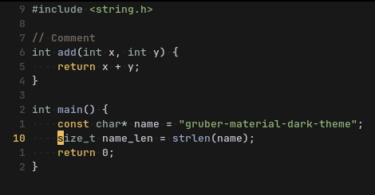

# Gruber Material Dark

Based on [Gruber Darker](https://github.com/rexim/gruber-darker-theme) and inspired by [Gruvbox Material](https://github.com/sainnhe/gruvbox-material).

## Screenshot

#### Default


#### Intense *(closer to the original, but still softer)*


## Installation

Clone the repository into your Emacs themes directory
```
git clone https://github.com/FilippoBSW/gruber-material-dark.git ~/.config/emacs/themes/gruber-material-dark
```
Add the theme to your Emacs config file
``` lisp
(add-to-list 'custom-theme-load-path (locate-user-emacs-file "themes/gruber-material-dark"))
(load-theme 'gruber-material-dark t) ; or 'gruber-material-dark-intense
```
